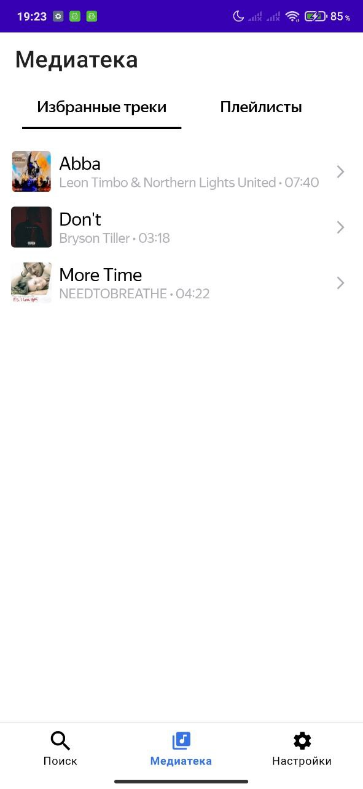
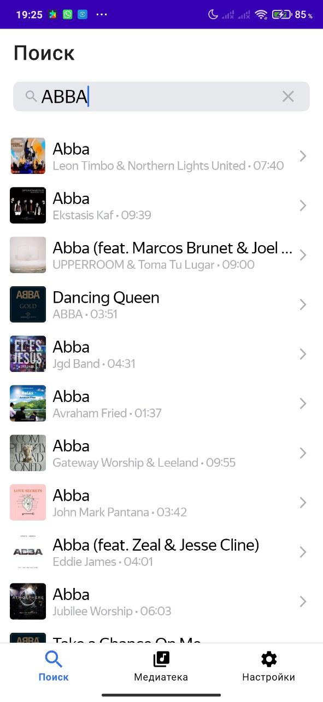

# PlaylistMaker
## Описание
Приложение “PlaylistMaker” позволяет искать и прослушивать треки в iTunes, добавлять треки в избранные, а также создавать и редактировать собственные плейлисты. Приложение поддерживает темную тему.
## Скриншоты

  
   
  

## Приобретенный опыт
В процессе разработки данного проекта я получила опыт в использовании следующих технологий и подходов:
- **Clean Architecture**: Применение принципов чистой архитектуры для разделения приложения на слои.
- **MVP и MVVM**: Изначально использовала паттерн MVP, затем переписала приложение на MVVM для улучшения поддерживаемости и тестируемости кода.
- **Retrofit**: Использовала Retrofit для взаимодействия с iTunes API.
- **Coroutines и Flow**: Реализовала асинхронные операции с использованием Coroutines и Flow для эффективного управления потоками данных.
- **Room**: Использовала базу данных Room для хранения избранных треков и созданных плейлистов.
- **MediaPlayer**: Использовала MediaPlayer для воспроизведения треков.
- **Koin**: Внедрение зависимостей с помощью Koin для упрощения управления зависимостями.
- **Single Activity Architecture**: Изначально работала с несколькими Activity, затем перешла на архитектурный подход Single Activity для улучшения навигации и управления состоянием приложения.
## Библиотеки
Room,
Kotlin Coroutines,
Timber,
Navigation,
Fragment KTX,
Material Components,
Glide,
Gson,
Retrofit,
Koin,
Lifecycle ViewModel KTX,
AppCompat,
ConstraintLayout

## Требования
- **IDE**: Android Studio Iguana
- **JDK**: Java 17
- **Kotlin**: 1.7.10
